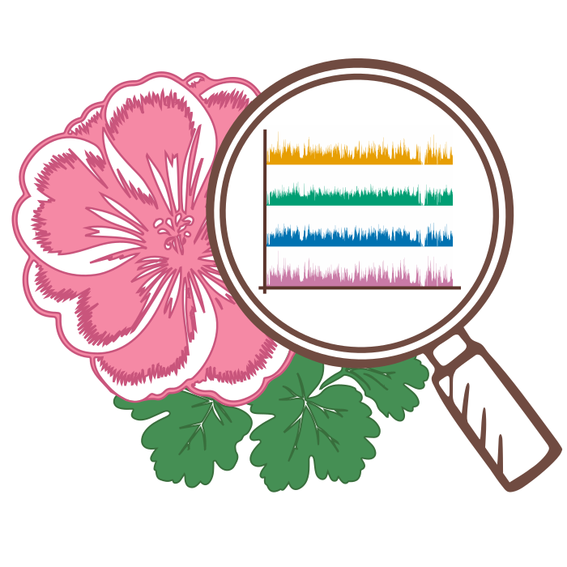

# Geranium

<h1 align="center">
  
  <br>Geranium
</h1>

<p align="center">
  <i><ins>Ge</ins>nomics Data Visualization <ins>R</ins>etrieval for <ins>A</ins>uthori<ins>n</ins>g w<ins>i</ins>th M<ins>u</ins>lti<ins>m</ins>odality</i>
</p>

## Citation

Preprint: [Nguyen, Huyen N., et al. “Multimodal Retrieval of Genomics Data Visualizations.” OSF Preprints, 2025.](https://osf.io/zatw9_v1)

```bib
@article{nguyen2025multimodal,
  title={Multimodal Retrieval of Genomics Data Visualizations},
  author={Nguyen, Huyen N and L’Yi, Sehi and Smits, Thomas C and Gao, Shanghua and Zitnik, Marinka and Gehlenborg, Nils},
  year={2025},
  publisher={OSF Preprints},
  url={https://osf.io/zatw9_v1},
  doi={10.31219/osf.io/zatw9_v1},
}
```

## Overview

Geranium is a multimodal retrieval system that helps researchers efficiently find genomics visualization examples using image, text, or specification-based queries. Search results function as adaptable templates/scaffolds that researchers can modify with their own data and design preferences.


## Features

- **Flexible query approaches**: Choose your preferred search method - example images, natural language queries, or partial Gosling specification queries for precise visualization retrieval

- **Adaptable visualization scaffolds**: Search results function as modifiable templates, not just static examples

- **Integrated live editor**: Edit and customize retrieved visualizations directly within the application

- **Triplet output**: Each resulting visualization is returned as a triplet of image, text, and its corresponding Gosling specification

- **Diverse Collection**: The collection spans single-view to multi-view visualizations for specialized genomic applications like epigenomics and structural variation analysis


## Installation

The application consists of two components: a server and a client that need to be run separately.

### Server Installation

1. Navigate to the server directory:
   
    ```
    cd server
    ```
2. Create and activate a Python virtual environment:
   
    ```
    python3 -m venv .venv
    source .venv/bin/activate
    ```

3. Install the required dependencies:
    ```
    python3 -m pip install -r requirements.txt
    ```

Alternatively, if using uv package manager:
    ```
    uv pip install -r requirements.txt
    ```

4. Start the server:

    ```
    flask --app app.py run
    ```

The server will start on http://localhost:5000 by default.

### Client Installation

1. Open a new terminal and navigate to the client directory:
    
    ```
    cd client
    ```

2. Install the necessary dependencies:

    ```
    npm install
    ```

3. Start the client application:

    ```
    npm run dev
    ```

Once started, the client will be available at http://localhost:5173/

## Usage

After both the server and client are running, open your browser and navigate to http://localhost:5173/ to start using Geranium.

- Make sure the server is running before accessing the client.

- The client will attempt to interact with the backend hosted by Flask on its default port.


## Contributing

Contributions are welcome! If you'd like to contribute, please open an issue or submit a pull request.

